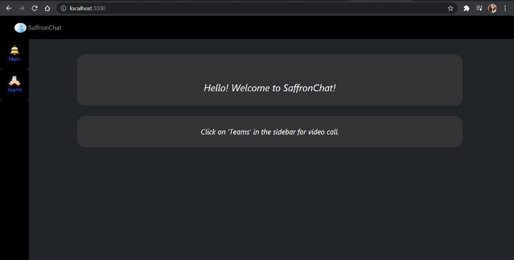
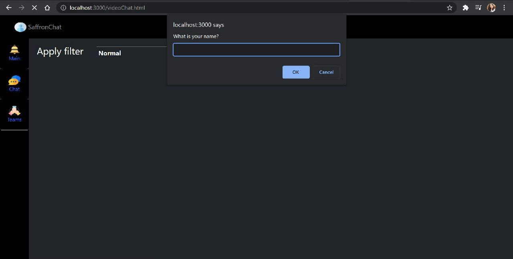
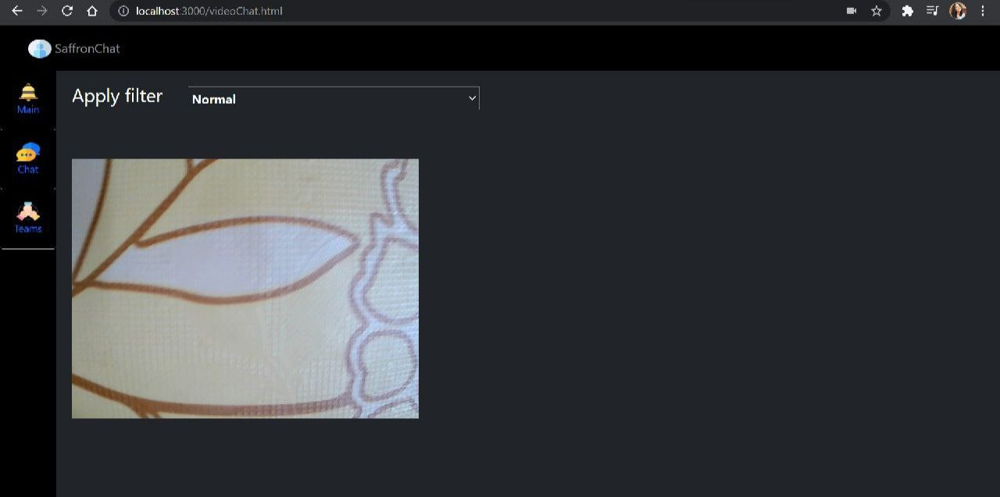
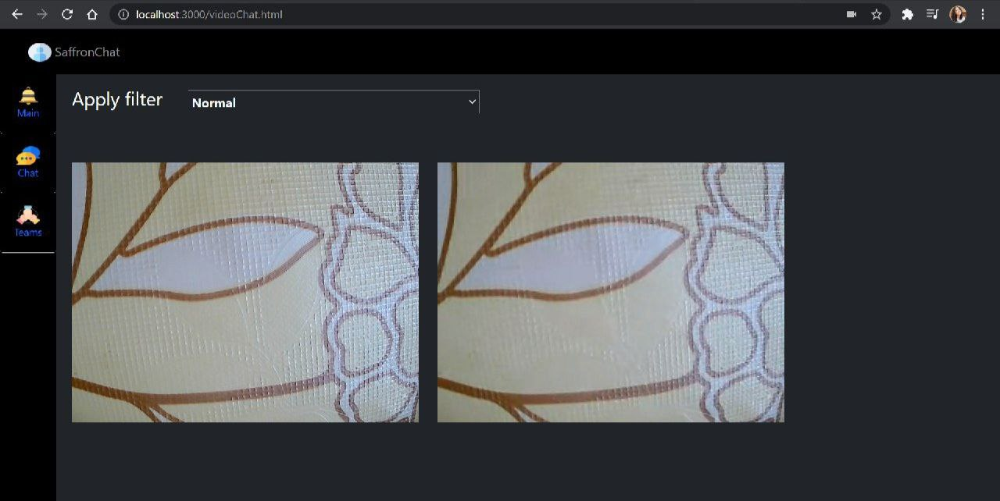
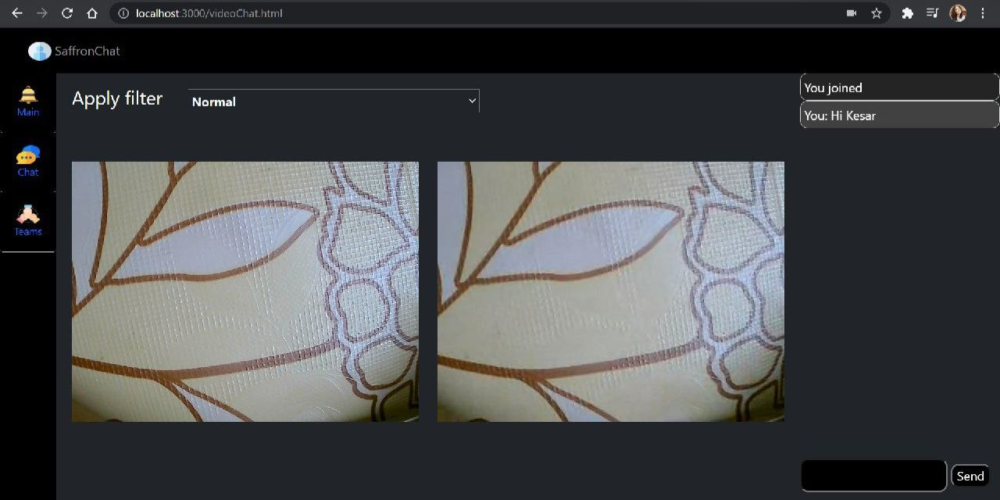
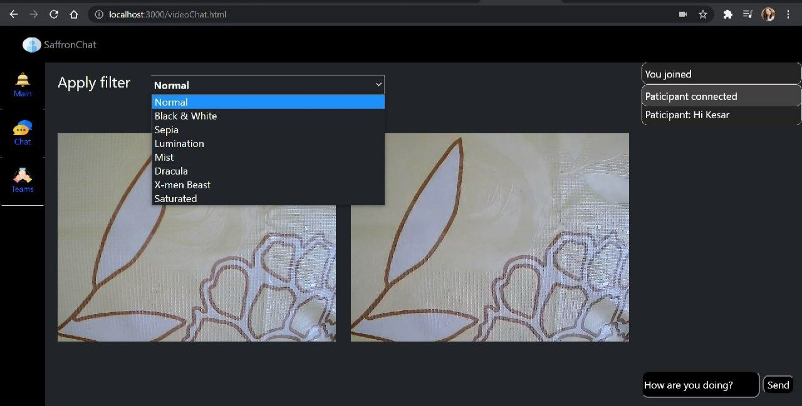
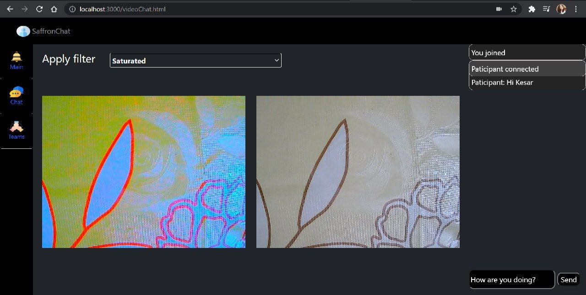
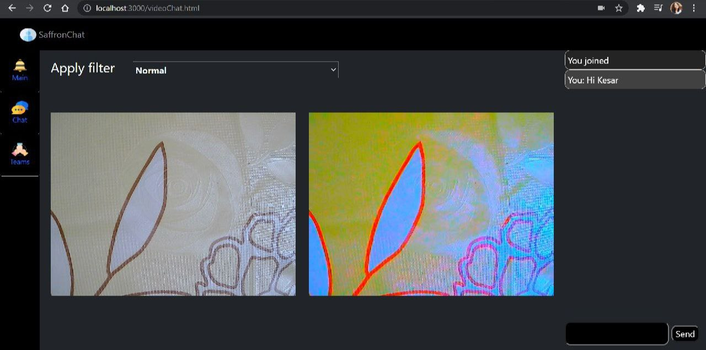

# MS-Engage-Teams-Clone

Thanks for dropping in!

## SaffronChat

This is SaffronChat. Two people can have video call and chat together at the same time.
To add some spice to the video call, the filters are provided with which the video call can be made more interesting.

Hence the features are:
- Video call
- Chat
- Filters

## Demo

You can find the video demo here https://youtu.be/Gkl52hVGCks

## Technologies used

I have used:
- WebRTC
- Simple Peer Package
- Node.js
- HTML
- Bootstrap for styling
- Socket.io

## Run the application

- Download the file.
- Extract it.
- Run 'npm start' in the development mode.
- Open http://localhost:3000 to view it in the browser.

## Screenshots

